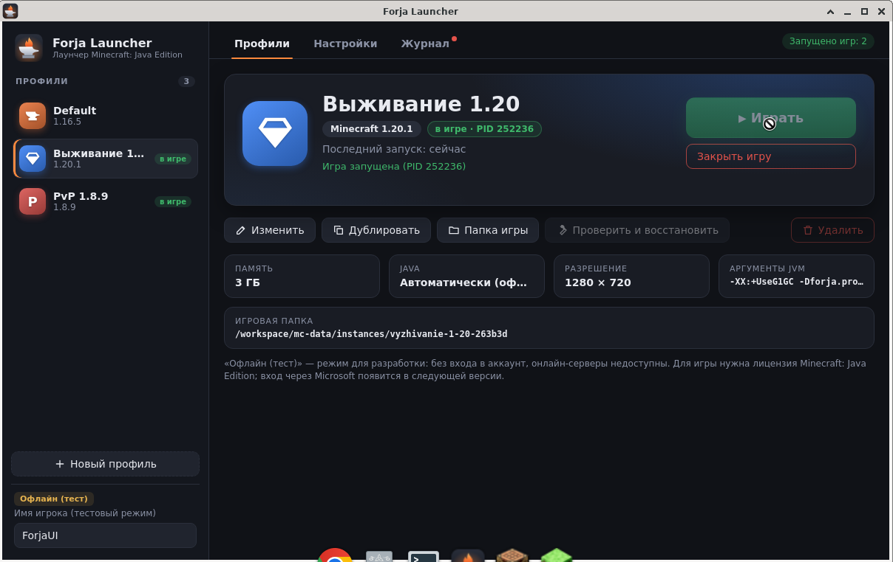

# Forja Launcher

Кроссплатформенный (Windows / macOS / Linux) лаунчер **Minecraft: Java Edition** на Electron.
Готовы **фаза 1 — ядро** (установка любой версии из официальных источников Mojang, загрузка
нужной Java, запуск игры) и **фаза 2 — профили, настройки и новый интерфейс**.

> «Forja Launcher» — временное название. Переименовать можно в одном файле: `src/main/config.js`
> (плюс `productName`/`appId` в `package.json` для сборки).

Лаунчер легальный: всё скачивается только с официальных серверов Mojang
(`piston-meta.mojang.com`, `libraries.minecraft.net`, `resources.download.minecraft.net`,
Mojang Java runtime manifest; Adoptium — только как запасной вариант для Java).
Логотипы Mojang/Minecraft не используются. Для игры нужна лицензия Minecraft: Java Edition.

## Что работает (фаза 1)

- Список версий из манифеста Mojang с кэшем (работает и без сети по кэшу): фильтры
  релизы / снапшоты / старые (beta/alpha), поиск.
- Установка версии:
  - описание версии (JSON) с проверкой SHA1, поддержка `inheritsFrom` (задел для модлоадеров);
  - клиентский jar, библиотеки с учётом `rules` (ОС, архитектура, версия ОС, features);
  - natives: старый формат (`natives` + `classifiers`, `${arch}`, `extract.exclude`)
    и новый (natives как обычные библиотеки `…:natives-linux`, с фильтром по архитектуре);
  - asset index + объекты; legacy-форматы: `virtual` (1.6.x) и `map_to_resources` (до 1.6);
  - конфиг логирования log4j (XML-логи игры разбираются в читаемые строки).
- Загрузчик: параллельно (8–16 потоков), проверка SHA1 и размера, повторы с backoff,
  докачка `.part` через HTTP Range, пропуск уже валидных файлов, отмена, прогресс.
- Java: нужная версия берётся из `javaVersion` в JSON версии (по умолчанию Java 8),
  скачивается официальный Mojang runtime для текущей платформы
  (`windows-x64/x86/arm64`, `mac-os`, `mac-os-arm64`, `linux`, `linux-i386`),
  проверяется SHA1, выставляются права на исполнение и символические ссылки (unix),
  проверка через `java -version`. Для платформ без Mojang runtime (например, Linux arm64) —
  Adoptium с проверкой SHA256.
- Запуск: classpath с правильным разделителем (`;` на Windows, `:` на unix),
  JVM- и игровые аргументы из нового формата `arguments` и старого `minecraftArguments`,
  подстановка всех плейсхолдеров (`${auth_player_name}`, `${version_name}`, `${game_directory}`,
  `${assets_root}`, `${game_assets}`, `${assets_index_name}`, `${auth_uuid}`, `${auth_access_token}`,
  `${user_type}`, `${version_type}`, `${natives_directory}`, `${launcher_name}`, `${launcher_version}`,
  `${classpath}`, `${classpath_separator}`, `${library_directory}`, `${resolution_width/height}`…),
  память `-Xms/-Xmx`, вывод stdout/stderr игры в журнал интерфейса.
- **Офлайн (тест)** — только режим разработки/тестирования: локальное имя игрока,
  UUID как в vanilla (UUID v3 от `OfflinePlayer:<имя>`). Никакой авторизации не выполняется,
  на online-mode серверы зайти нельзя. Модуль входа через Microsoft подключается в фазе 4
  (`src/main/auth/microsoft.js` — заглушка с описанием потока).

## Что добавлено в фазе 2

- **Профили (инстансы)**: создание, изменение, дублирование (с копированием папки), удаление
  (по желанию — вместе с папкой; последний профиль удалить нельзя). У профиля есть имя, значок
  (12 встроенных простых значков или буква + цвет), версия Minecraft, своя игровая папка
  `instances/<id>/`, своя память, JVM-аргументы (с кавычками), разрешение / полный экран,
  Java (как в настройках или свой путь, с проверкой), время последнего запуска.
  Хранятся в `profiles.json` (`schemaVersion`, атомарная запись tmp → fsync → rename, копия `.bak`,
  повреждённый файл сохраняется как `.corrupt-*` и восстанавливается из `.bak`).
  Старая `instances/default` и настройки фазы 1 автоматически переносятся в профиль «Default».
- **Natives на каждый запуск**: распаковка во временную папку `tmp/natives/<версия>-XXXX`,
  удаление после выхода игры; при старте лаунчера удаляются брошенные папки (процесс-владелец мёртв).
  Решает проблему блокировки файлов на Windows при двух запусках одной версии.
- **Настройки**: язык (ru/en, переключается сразу), память и Java по умолчанию, число
  одновременных загрузок (1–32), что делать при запуске игры (оставить / скрыть / закрыть лаунчер),
  показ снапшотов/старых версий по умолчанию, папка данных (путь + «Открыть»),
  «Проверить и восстановить» для профиля (SHA1 всех файлов версии, ресурсов и Java, перекачка испорченных).
- **Интерфейс**: боковая панель с профилями (значки, бейджи «запущено»/«установка», мини-прогресс),
  большая карточка выбранного профиля с кнопкой «Играть», прогресс со скоростью и оставшимся временем,
  вкладки «Профили / Настройки / Журнал» (журнал с фильтром по профилю), тёмная тема, анимации,
  клавиатура (стрелки по вкладкам, Ctrl+1/2/3, Ctrl+N — новый профиль, Esc, ловушка фокуса в окнах),
  всплывающие уведомления и понятные русские сообщения об ошибках (нет сети, мало места на диске —
  проверка свободного места до загрузки, нет прав, неверная Java и т. д.).
- **Несколько запущенных игр** (по одной на профиль), «Закрыть игру» для каждой; при падении
  (ненулевой код выхода) — окно с последними ~50 строками журнала, «Копировать» и
  «Открыть папку crash-reports».
- **Иконка приложения** (наковальня и пламя, своя графика): `src/assets/icon.svg`, `build/icon.png` (512),
  `build/icon-256.png`, `build/icon-512.png`, `build/icon-1024.png`, `build/icon.ico`, `build/icon.icns`
  (генерация: `npx electron scripts/render-icon.js`).

Проверено на Linux x64 (см. `docs/TEST-REPORT.md`): установлены и запущены 1.20.1, 1.8.9,
1.12.2, 1.16.5 (установка + отмена), 1.6.4, 1.5.2 и 26.3 — игра доходит до главного меню;
в фазе 2 два профиля (1.20.1 и 1.8.9) запущены из интерфейса одновременно с разными игровыми папками.



## Запуск

Требуется Node.js ≥ 18.17 (проверено на 20.x).

```bash
npm install
npm start          # запустить лаунчер
npm test           # модульные тесты (без сети)
npm run test:integration   # интеграционный тест: реальная установка 1.20.1 и 1.8.9 во временную папку (~1 ГБ)
node scripts/headless-launch.js 1.20.1 Tester --timeout 60   # установка и запуск без Electron
```

Параметры для разработки (переменные окружения):

- `FORJA_DATA_DIR=/путь` — другая папка данных лаунчера;
- `FORJA_IT_DIR`, `FORJA_IT_VERSIONS=1.20.1,1.8.9` — для интеграционного теста.

Если Electron не стартует в контейнере/виртуалке без sandbox, запускайте локально
`npx electron . --no-sandbox` — этот флаг **не** добавлен в код и в сборку намеренно.

## Где хранятся данные

Отдельно от стандартной `.minecraft`:

| ОС      | Папка |
|---------|-------|
| Windows | `%APPDATA%\Forja Launcher` |
| macOS   | `~/Library/Application Support/Forja Launcher` |
| Linux   | `$XDG_DATA_HOME/forja-launcher` или `~/.local/share/forja-launcher` |

Внутри: `versions/`, `libraries/`, `assets/` (indexes, objects, virtual, log_configs),
`runtime/` (Java), `instances/<id профиля>/` (игровые папки), `tmp/natives/` (временные natives),
`cache/`, `settings.json`, `profiles.json`.

## Структура проекта

```
src/
  main/
    main.js            — главный процесс Electron, IPC
    config.js          — название лаунчера и официальные адреса (переименование — здесь)
    auth/
      index.js         — реестр провайдеров входа (единый формат сессии)
      offline.js       — «Офлайн (тест)», offline UUID
      microsoft.js     — заглушка под фазу 4
    core/              — ядро, обычные Node-модули без Electron (тестируются отдельно)
      paths.js         — папка данных по ОС и раскладка каталогов
      platform.js      — имя ОС/архитектура в терминах Mojang, разделитель classpath
      rules.js         — вычисление rules (os/arch/version/features)
      library.js       — maven-пути, разрешение библиотек и natives
      http.js          — fetch с User-Agent и повторами
      download.js      — параллельный загрузчик (SHA1, повторы, докачка, отмена)
      versions.js      — манифест версий, кэш, фильтры
      install.js       — установка версии (jar, библиотеки, natives, ресурсы, логирование)
      java.js          — Mojang Java runtime / Adoptium
      launch.js        — сборка аргументов и запуск процесса
      log4j.js         — разбор XML-логов игры
      launcher.js      — оркестрация: установка → Java → natives → запуск → очистка
      atomic.js        — атомарная запись JSON, чтение с откатом на .bak
      settings.js      — глобальные настройки (settings.json, схема v2, миграция v1)
      profiles.js      — профили (profiles.json), CRUD, миграция instances/default
      natives.js       — временные папки natives на запуск, очистка, уборка брошенных
      games.js         — менеджер запущенных игр (состояния, журналы, kill, crash)
      errors.js        — классификация ошибок → коды для понятных сообщений
      repair.js        — «Проверить и восстановить»
  preload/preload.js   — узкий API через contextBridge
  renderer/            — интерфейс (HTML/CSS/JS без фреймворков): index.html, styles.css, app.js,
                         icons.js (значки профилей), i18n/ru.json, i18n/en.json
  assets/              — иконка приложения (svg/png)
build/                 — иконки для сборки (png/ico/icns)
scripts/render-icon.js — рендер иконки из SVG
test/unit/             — модульные тесты (node:test)
test/integration/      — интеграционный тест установки
scripts/headless-launch.js — установка и запуск без Electron
docs/                  — скриншоты и отчёт о тестировании
```

Безопасность Electron: `contextIsolation: true`, `nodeIntegration: false`, `sandbox: true`,
строгий CSP, запрет навигации и новых окон; рендерер общается с ядром только через
перечисленные в `preload.js` методы.

## Дорожная карта

- ~~Фаза 1 — ядро~~ ✅
- ~~Фаза 2 — профили/инстансы, настройки, новый интерфейс, natives на запуск, окно сбоя, иконка~~ ✅
  (не сделано и перенесено: удаление неиспользуемых версий/библиотек — фаза 3 вместе с менеджером модов).
- **Фаза 3 — моды:** Fabric, Quilt, Forge, NeoForge (через их официальные установщики/мета-API,
  `inheritsFrom` уже поддерживается), менеджер модов (Modrinth/CurseForge API).
- **Фаза 4 — аккаунты Microsoft:** вход через OAuth 2.0 → Xbox Live → XSTS → Minecraft Services,
  проверка владения игрой, несколько аккаунтов, безопасное хранение токенов (OS keychain через `safeStorage`).
- **Фаза 5 — релиз:** сборки electron-builder (Windows NSIS, macOS DMG/ZIP с подписью и нотаризацией,
  Linux AppImage/deb), автообновление, CI. Иконки уже готовы в `build/`
  (для macOS можно дополнительно пересобрать `icon.icns` через `iconutil`); для deb добавить зависимость `libegl1`.

### Важно про вход через Microsoft

Для входа через Microsoft нужно **зарегистрировать приложение в Azure (Microsoft Entra ID)** и получить
Client ID, а затем **подать заявку Mojang на доступ к Minecraft API** для этого приложения
(новые Azure-приложения без одобрения получают отказ от `api.minecraftservices.com`).
Client ID будет храниться в конфигурации, а не в коде; секреты в клиентском приложении не используются
(публичный клиент, device code или auth code + PKCE).

## Известные ограничения

См. `docs/TEST-REPORT.md` → «Известные проблемы».
